# projet-ms-ebank-app

## 1. première partie

### Customer service
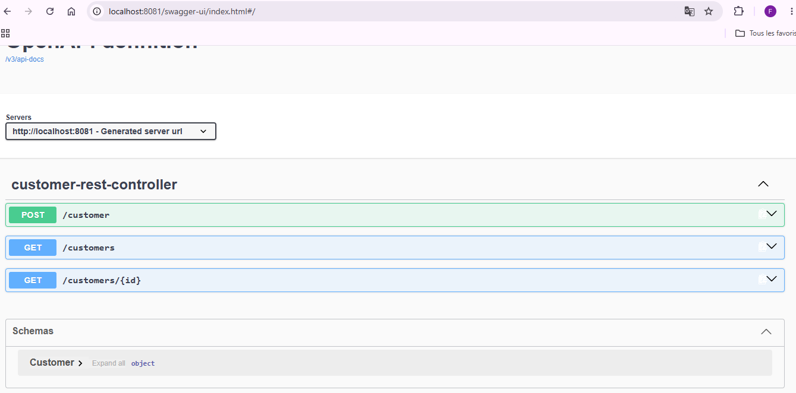

### Ebank service
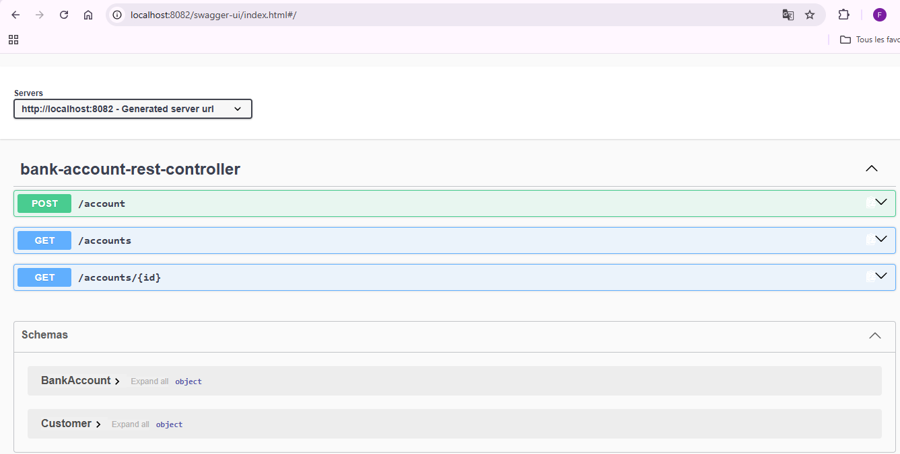

### Discavery Service : Eurica-Server
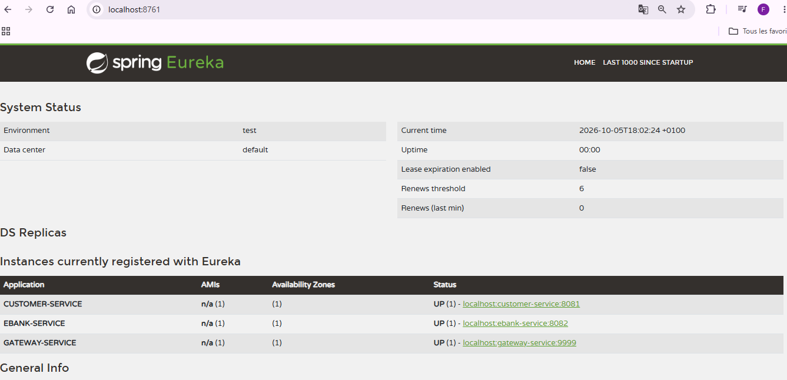

### GateWay : routage dynamique
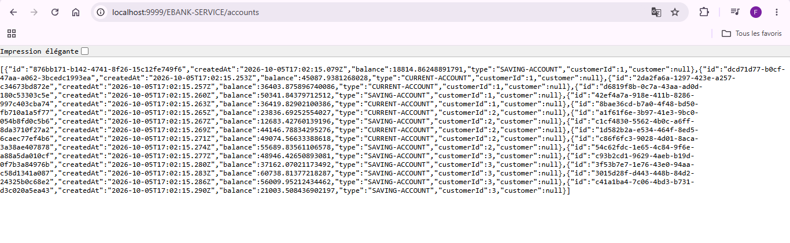

### OpenFeign
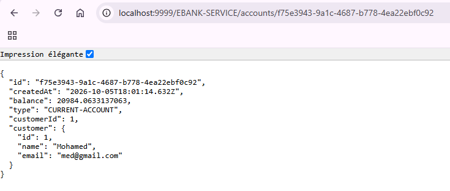

### CircuitBreaker : Resilience4j
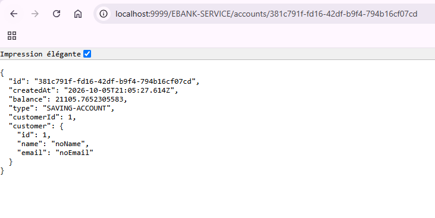

## 2. Chat Bot

### premier test de LLM
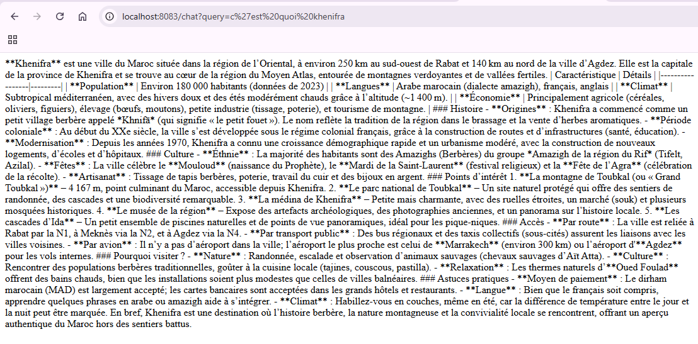
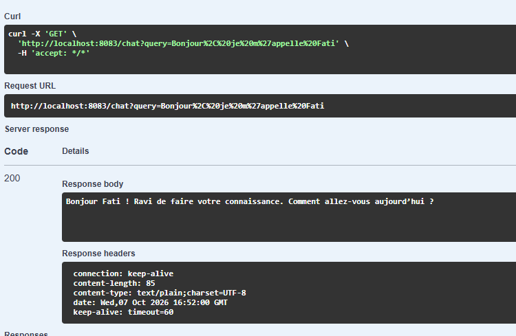
### ajouter une mémoire 
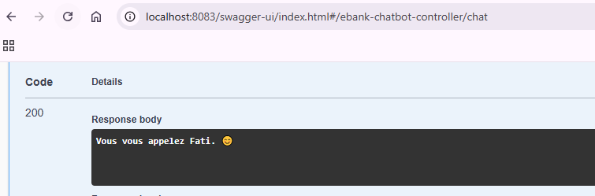

### Customer tools
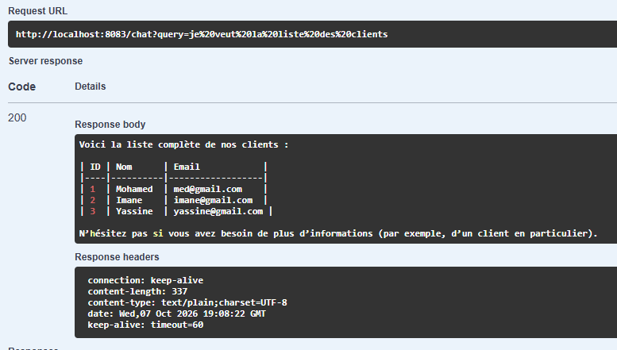

### Bank Account tools
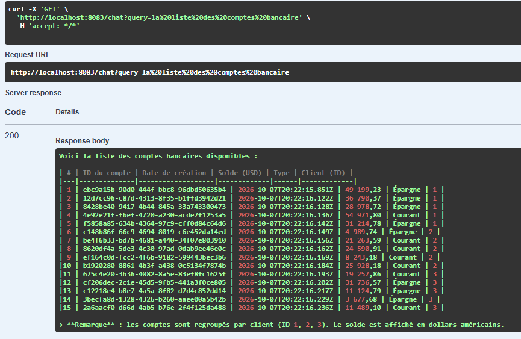

### Préciser le context
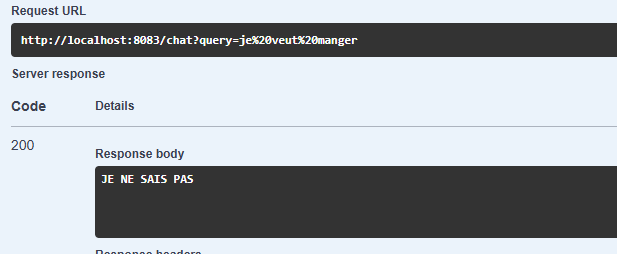

### Ebak-bot avec la gateWay
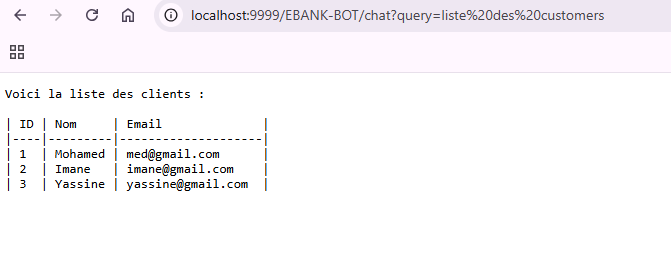

### Bot Telegram
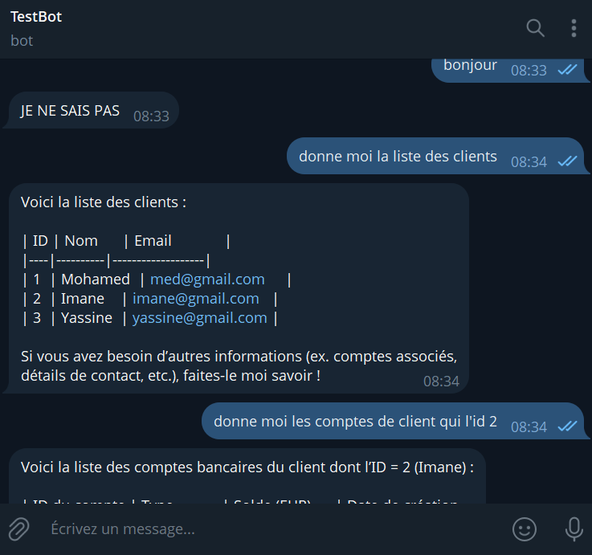